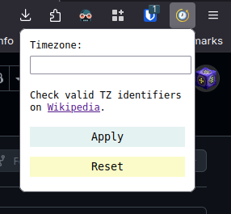

# Time Gate

Set your browser time zone on a per-site basis.

 > [!NOTE]
 > This repository is mirrored to [GitHub](https://github.com/BogTheMudWing/time-gate) for visibility. Issues and pull requests should be made on [Macver Code Athenaeum](https://code.macver.org/Bog/time-gate).

Install: <https://addons.mozilla.org/addon/time-gate/>

## About

I use [LibreWolf](https://librewolf.net), which comes with anti-fingerprinting measures enabled by default. One of these measures is to report the time zone as UTC+0. However, there are some trusted websites which I would like to report my real time zone. This extension allows me to do this.

To set the time zone for a site, open the extension popup, enter the time zone you wish for the current site to use, and click apply. You can click reset to use the time zone provided by the browser.

You need to reload the page to apply changes.

[Time icons created by Freepik - Flaticon](https://www.flaticon.com/free-icons/time)